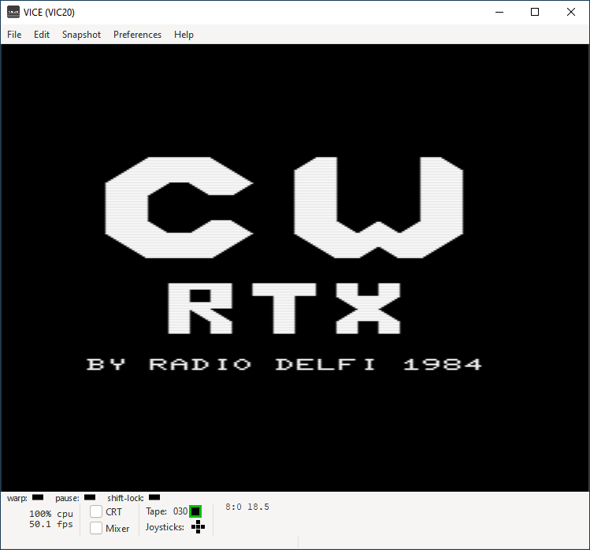

****** CW-RTX ******
====================
BY RADIO DELFI 1984

Un programma per ricevere e trasmettere in CW con il VIC-20
-----------------------------------------------------------
Questo programma è stato sviluppato per trasformare il Commodore VIC-20 in un dispositivo da collegare a ricetrasmettitori amatoriali per ricevere e trasmettere in telegrafia. 

Il programma **CW-RTX.B** fornisce le funzioni che permettono ad un operatore di lavorare in CW (trasmissione, ricezione, ecc.). Il programma è scritto in BASIC ma richiama le routine in linguaggio macchima che implementano tutte le funzioni di codifica e decodifica dei segnali CW e di interfaccia alla radio (RIG). 

Nella cartella *assembly* sono inseriti i listati delle due routine principali utilizzate da CW-RTX, scritte in Assembly 6502, **ROUTINE-RX.S** e **ROUTINE-TX.S**. Le routine sono state ottenute mediante un processo di disassemblaggio automatico. Per questa ragione non vi sono etichette o commenti utili a comprendere il loro funzionamento. 

### VICE - the Versatile Commodore Emulator
CW-RTX è stato provato con l'emulatore VICE che può essere scaricato qui... http://vice-emu.sourceforge.net/. Il codice BASIC che contiene anche le routine in linguaggio macchina, può essere copiato ed incollato direttamente su VICE con la funzione *Edit/Paste*. Per comodità, nella cartella *tap* è inserito il file **cw-rtx.tap** che può essere caricato ed eseguito con la funzione *Attach datasette image ...* di VICE.

### Archeologia informatica
CW-RTX non è stato testato in tutte le sue funzionalità. Il programma va utilizzato esclusivamente come esempio di programmazione pioneristica per l'impiego dei primi computer basati su microprocessore nel campo delle applicazioni radiantistiche. 

Nella cartella *docs* sono presenti alcune scansioni di documenti originali dell'epoca in cui è presente del codice. I documenti contengono varie stesure dei programmi ed appunti di progetto. Questi documenti sono stati inseriti per dimostrare che in mancanza di strumenti IDE la programmazione era anche un esercizio di grande pazienza. Il codice delle routine in Assembly 6502 presenti in questo programma fu inserito e testato nel VIC-20 utilizzando il programma **ASSBLY TOOL** presente nella repository... https://github.com/s9r5/assbly/ 